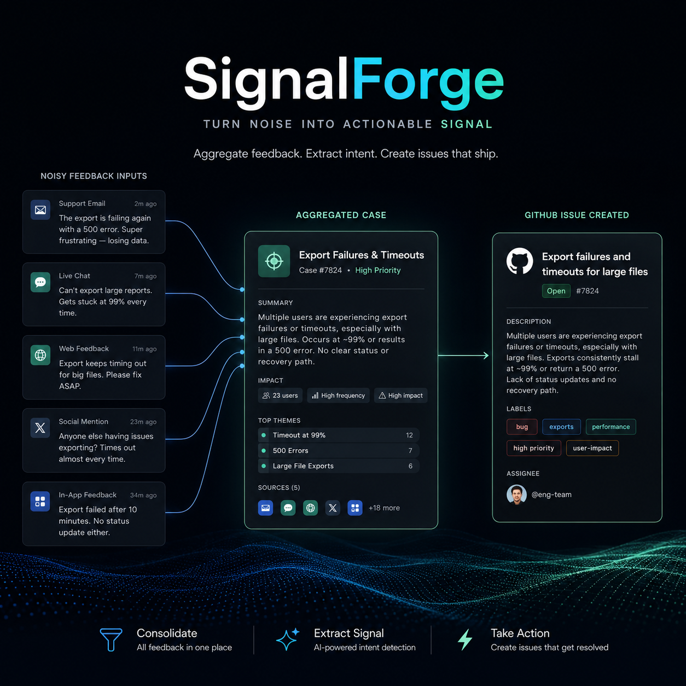
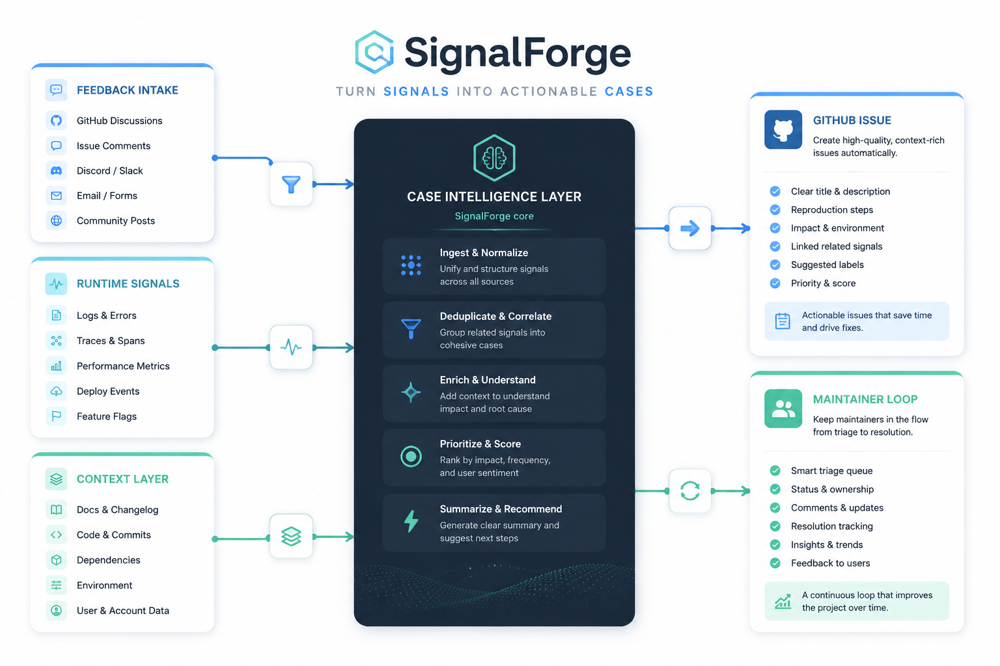

# SignalForge

<p align="center">
  <strong>Case intelligence for product teams shipping on GitHub.</strong>
</p>

<p align="center">
  Turn user feedback into decision-ready GitHub issues.
</p>

<p align="center">
  <a href="./docs/vision.md"></a>
  <a href="./docs/api-contract.md"></a>
  <a href="./docs/live-e2e.md"></a>
  <a href="./docs/llm-triage.md"></a>
</p>

<p align="center">
  <a href="./docs/vision.md">Vision</a> ·
  <a href="./docs/architecture.md">Architecture</a> ·
  <a href="./docs/api-contract.md">API Contract</a> ·
  <a href="./docs/live-e2e.md">Live E2E</a> ·
  <a href="./docs/github-flow.md">GitHub Flow</a>
</p>

SignalForge merges duplicate feedback, enriches it with runtime context, and publishes the cases that deserve engineering attention.

It is built for teams that already live in GitHub and do not want another heavyweight support or ticketing system.

<p align="center">
  
</p>

> Fewer duplicate tickets. Better case formation. Faster maintainer decisions.

## Why It Lands

Most product teams already have the signals:

- user feedback
- bug reports
- runtime errors
- screenshots
- repeated frustration

What they usually do not have is a clean path from those noisy signals to one clear engineering decision.

SignalForge gives them that path:

- merge repeated reports into one case
- summarize the problem in engineering language
- keep reporter and evidence counts attached
- auto-publish to GitHub when policy allows
- let maintainers make the real decision inside the GitHub workflow

This is not "collect feedback and hope someone reads it later."

This is "turn repeated user pain into fewer, higher-value GitHub issues."

## What It Does

- feedback intake for end-user submissions
- runtime signal ingestion and case enrichment
- aggregation-aware triage with stable clustering
- canonical case summaries and evidence rollups
- automatic GitHub issue publication when policy says `publish_now`
- owner decisions synced from GitHub comments
- context retrieval for follow-up automation and delegation
- adapter-first integration for existing web apps

## System Flow

<p align="center">
  
</p>

```text
user feedback + runtime signals
-> SignalForge
-> aggregated case
-> decision-ready GitHub issue
-> maintainer decision
-> execution / delegation
```

## Why It Feels Different

SignalForge is opinionated about one thing:

the goal is not to create more tickets.

the goal is to create fewer, better decision surfaces.

That means:

- duplicate reports should usually collapse into one case
- GitHub issue creation can be automatic
- issue creation is not the same as committing engineering work
- maintainers should make one real decision, not approve the same thing twice

## Quick Example

Two users complain that the mobile reader popup blocks the text.

A normal workflow gives you:

- two feedback records
- maybe one Sentry event
- maybe no owner action

SignalForge gives you:

- one aggregated case
- one canonical title and summary
- reporter and evidence counts
- a GitHub issue if the case is actionable

## Verified End-to-End

SignalForge has already been validated against a real GitHub App flow:

- deployed behind HTTPS at `sf.launchhub.icu`
- real GitHub App issue publication
- real GitHub webhook delivery
- real owner decision sync from GitHub issue comments back into SignalForge state

Verified flow:

```text
feedback submission
-> case creation / aggregation
-> GitHub issue publish
-> owner comments /accept or /defer
-> GitHub webhook
-> SignalForge decision record + case status update
```

See `docs/live-e2e.md` for deployment notes, verification details, and known gaps.

## Easy Start

SignalForge includes an adapter-first integration path for existing web apps.

```text
your app
-> @signalforge/adapter
-> SignalForge API
-> case aggregation / GitHub / delegation
```

```js
import { createSignalForgeAdapter } from '@signalforge/adapter';

const sf = createSignalForgeAdapter({
  endpoint: 'https://signalforge.example.com',
  projectKey: 'proj_readerapp',
  appName: 'readerapp',
  environment: 'production',
  release: '1.2.3',
});

await sf.captureFeedback({ body: 'Save button freezes on mobile.' });
await sf.captureError(new Error('reader timeout'));

const unbind = sf.installGlobalErrorHandlers();
sf.mountFeedbackWidget(document.getElementById('sf-root'), {
  defaultOpen: false,
  includeContactField: true,
});
```

## What SignalForge Is

- a feedback-to-issue engine
- a GitHub-native case aggregation layer
- a maintainer decision surface
- an automation handoff point for agents and skills

## What SignalForge Is Not

- a full support desk
- a full issue tracker
- a replacement for Sentry or GlitchTip
- a full CI/CD system
- a magical auto-fix bot

## Runtime Signals

SignalForge does not try to replace mature exception monitoring tools.

Recommended layering:

- Sentry or GlitchTip for runtime collection
- SignalForge for aggregation, case correlation, publication, and orchestration

## GitHub Publication Modes

SignalForge supports a staged GitHub publication strategy:

- `preview`: local issue-like publication for flow validation
- `pat`: real GitHub issue creation through a repository token
- `app`: GitHub App publisher boundary with installation-token-based skeleton and JWT-based installation token exchange

The API flow should stay the same across these modes.

Only the publisher implementation should change.

## LLM Role

The LLM is advisory, not authoritative.

Its job is to:

- merge similar raw feedback
- filter low-value noise and support-like content
- translate user language into engineering language
- produce decision-ready case summaries

If the LLM is unavailable or invalid, SignalForge falls back to deterministic heuristic triage.

## Docs

- `docs/vision.md`
- `docs/object-model.md`
- `docs/api-contract.md`
- `docs/github-flow.md`
- `docs/privacy.md`
- `docs/mvp.md`
- `docs/architecture.md`
- `docs/roadmap.md`
- `docs/llm-triage.md`
- `docs/readerapp-e2e-sample.md`
- `docs/github-app-setup.md`
- `docs/live-e2e.md`

## LLM Setup

SignalForge can run in two modes:

- heuristic fallback only
- DeepSeek-backed LLM triage

Set these env vars to enable DeepSeek:

```bash
DEEPSEEK_API_KEY=...
DEEPSEEK_BASE_URL=https://api.deepseek.com
DEEPSEEK_MODEL=deepseek-v4-flash
```

If no key is configured, SignalForge continues using heuristic triage.

For local startup with a repo-level `.env`, run:

```bash
node scripts/start_api_with_env.mjs
```

GitHub publisher env:

```bash
GITHUB_PUBLISHER=preview
GITHUB_TOKEN=
```
